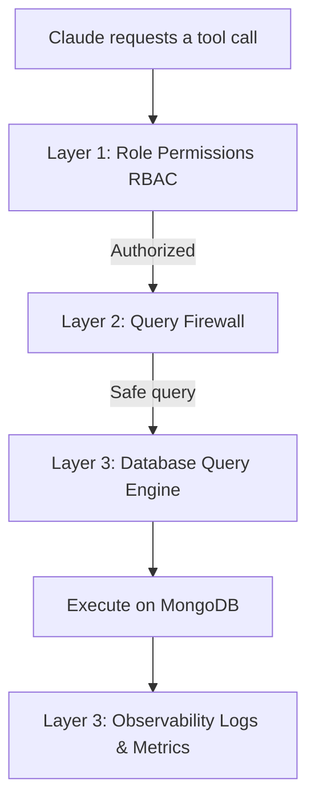

# Welcome to mongo-mcp-pro! 👋

`mongo-mcp-pro` is a secure Model Context Protocol (MCP) server written in TypeScript. Think of it as a smart, secure gateway that lets an AI query your MongoDB databases safely, with support for multi-environment routing, distinct database security modes, and robust guardrails.

---

## 🌟 What is MCP?

**Model Context Protocol (MCP)** is an open standard that acts like a **USB port for AI**. Instead of writing custom integrations for every tool, MCP defines a standard way for Claude Desktop (or other clients) to communicate with external tools over standard input/output (stdin/stdout).

---

## 🛡️ The 3-Layer Security Pipeline

Every query called by the AI goes through a **3-Layer Security Pipeline** before running on your database:



### 1. Database Mode-Based Access Control (RBAC) (`src/security/rbac.ts`)
Controls what operations are permitted based on the environment's mode:
* **`restricted`**: Only permits read operations (`find`, `find_one`, `count`, `distinct`, `aggregate`, `list_collections`, `collection_stats`, `list_indexes`).
* **`unrestricted`**: Permits read and write operations (`insert_one`, `insert_many`, `update_one`, `update_many`, `create_index`, `create_collection`), plus raw commands through the query tool. All document deletions and collection drops are strictly blocked.

### 2. The Query Firewall (`src/security/firewall.ts` & `src/tools/query.ts`)
Protects against dangerous queries and injection attempts:
1. **No System Collections**: Prevents targeting any internal collection (e.g., those starting with `system.`).
2. **No `$where` JavaScript Injection**: Blocks the `$where` operator to prevent server-side JS injection inside MongoDB.
3. **Recursive Safety Filtering**: The `query` tool scans all raw command structures and drops any payload containing forbidden keywords (e.g., `delete`, `drop`, `dropDatabase`, `dropIndexes`, `remove`, `truncate`, `eval`, `shutdown`).

### 3. Observability (`src/observability/`)
Every action is audited and logged to `logs/audit.jsonl` in JSON Lines format, tracking parameters like operation, environment, duration, and whether the command was blocked.

---

## 📂 Project Organization

```
src/
├── config/
│   ├── env.ts          - Parses and validates environments.yaml using Zod.
│   ├── db.ts           - Manages cached MongoDB connections per environment.
│   └── dbModes.ts      - Defines which tools are allowed in restricted vs unrestricted modes.
├── security/
│   ├── rbac.ts         - Checks if the current environment's mode allows the operation.
│   └── firewall.ts     - Validates query safety (blocks system collections and $where).
├── tools/
│   ├── index.ts        - Co-ordinates the security pipeline layers.
│   ├── read/           - Read tools (find, find_one, aggregate, etc.).
│   ├── write/          - Write tools (insert, update).
│   ├── schema/         - Metadata and environments tools.
│   └── admin/          - Indexing and collection management tools.
├── observability/
│   ├── logger.ts       - Standard JSON logger.
│   ├── audit.ts        - Logs transactions to logs/audit.jsonl.
│   └── metrics.ts      - Measures tool execution counts and latencies.
├── scripts/
│   ├── seed.ts         - Populates staging and production databases with test data.
│   └── verify-env.ts   - Runs local integration tests across environments.
├── types/
│   └── index.ts        - Shared TypeScript interfaces.
└── server.ts           - Entrypoint registering the 16 tools and running the server.
```

---

## ⚙️ Configuration (`environments.yaml`)

This project uses a YAML-based multi-environment configuration file (`environments.yaml`) in the project root:

```yaml
default: staging
environments:
  staging:
    mongoUri: "mongodb://localhost:27017"
    dbName: "staging_db"
    dbMode: "restricted"
  production:
    mongoUri: "mongodb://localhost:27018"
    dbName: "production_db"
    dbMode: "unrestricted"
sessionId: dev-session
logLevel: debug
auditLogPath: logs/audit.jsonl
```

* **`default`**: The environment used if no `environment` parameter is specified in the tool call.
* **`dbMode`**: Can be `restricted` (read-only) or `unrestricted` (read-write, but no delete/drop).

---

## 🚀 Getting Started

### 1. Start the Databases (using Docker Compose)
Make sure Docker Desktop is open and run:
```bash
docker compose up -d
```
This spins up:
- A staging MongoDB instance on `localhost:27017`
- A production MongoDB instance on `localhost:27018`

### 2. Install Dependencies & Build
```bash
npm install
npm run build
```

### 3. Seed the Databases
Populates Staging with 5 users and Production with 10 users:
```bash
npm run seed
```

### 4. Run Integration Verification
To verify that all 16 tools, RBAC modes, and safety firewalls are working correctly across environments:
```bash
npm run verify-env
```

---

## 🛠️ Registering with Claude Desktop

To make these 16 tools available inside your Claude Desktop client:

1. **Open the Claude configuration folder:**
   Press `Win + R`, paste `%APPDATA%\Claude`, and hit Enter. Open `claude_desktop_config.json` in a text editor.

2. **Add `mongo-mcp-pro` to the config file:**
   Point it to your Node installation and your compiled `server.js` file:

   ```json
   {
     "mcpServers": {
       "mongo-mcp-pro": {
         "command": "node",
         "args": [
           "c:/Users/Dharhshini/mongo-mcp-pro/dist/server.js"
         ]
       }
     }
   }
   ```

3. **Restart Claude Desktop:**
   Fully close Claude Desktop (from the system tray) and reopen it. You will see a hammer icon indicating the tools are loaded and ready.

---

## 🔒 Permissions Summary

| Operation | Tool Name | Allowed DB Modes |
|---|---|---|
| **Read** | `find`, `find_one`, `count`, `distinct`, `aggregate` | `restricted`, `unrestricted` |
| **Schema** | `list_collections`, `collection_stats`, `list_indexes`, `list_environments` | `restricted`, `unrestricted` |
| **Write** | `insert_one`, `insert_many`, `update_one`, `update_many` | `unrestricted` |
| **Admin** | `create_index`, `create_collection` | `unrestricted` |
| **Raw Query** | `query` (Filtered: no delete/drop/etc.) | `restricted` (Read-only commands), `unrestricted` (Read/Write commands) |

*(Note: document deletions and dropping collections/indexes have been completely removed from the server.)*
