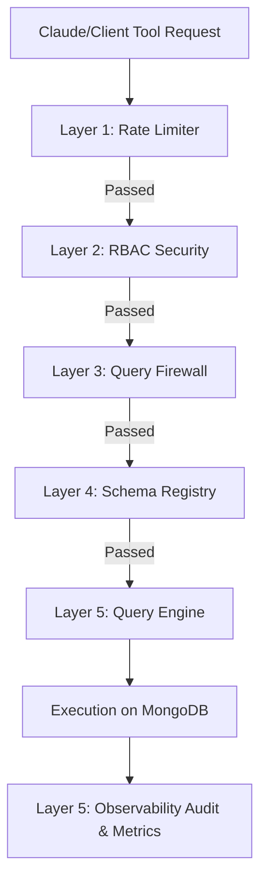

# mongo-mcp-pro

A production-grade Model Context Protocol (MCP) server that provides **Claude** (or any MCP-compatible LLM client) with safe, secure, and observable access to a MongoDB database.

---

## 🌟 What is MCP? (A Concept Primer)

Before diving into the codebase, let's understand **Model Context Protocol (MCP)**.
Traditionally, to connect an AI like Claude to external tools, developers had to write custom, ad-hoc integrations for every platform. MCP is a standard protocol created by Anthropic that acts like a **USB port for AI**. 

By running an MCP server, you register a set of **Tools** that Claude can request to invoke. Claude communicates with this server via standard input/output (stdin/stdout). When Claude decides it needs to read or write data in MongoDB, it sends a JSON request to the server, the server executes the query safely, and it returns the result to Claude.

---

## 🛡️ The 5-Layer Security & Observability Architecture

Connecting an AI directly to a database is highly risky. An AI might write a bad query that deletes all your data, read sensitive information, or get stuck in an infinite loop that crashes your database. 

To solve this, `mongo-mcp-pro` implements a **5-layer pipeline** that wraps every MongoDB tool call. If any layer fails, the operation is blocked, logged, and Claude receives a safe error message.



### 1. The Rate Limiter (`src/security/rateLimit.ts`)
* **Why it exists:** Protects MongoDB from denial-of-service (DoS) or runaway loops where Claude might repeatedly call a tool in a short timeframe.
* **How it works:** Restricts calls per minute based on the user's role:
  * `reader` → 300 calls/min
  * `writer` → 100 calls/min
  * `admin`  → 50 calls/min

### 2. Role-Based Access Control / RBAC (`src/security/rbac.ts`)
* **Why it exists:** Ensures users can only run commands they are authorized to perform.
* **How it works:** We assign roles (`reader`, `writer`, `admin`) to define permissions:
  * **Reader:** Can only read collections and query schemas (e.g., `find`, `count`, `list_collections`).
  * **Writer:** Can also modify documents (e.g., `insert_one`, `update_one`, `delete_one`).
  * **Admin:** Can perform administrative tasks (e.g., create/drop collections and indexes) and execute bulk deletes (`delete_many`).

### 3. Query Firewall (`src/security/firewall.ts`)
* **Why it exists:** Prevents malicious, buggy, or destructive queries from executing.
* **How it works:** It checks queries against four strict safety rules:
  1. **No system collection access:** Blocks any operations on collections starting with `system.` (internal MongoDB metadata collections).
  2. **No empty destructive filters:** Rejects `delete_many` or `update_many` calls if the filter is empty (which would wipe out or modify the entire collection).
  3. **No `$where` operator:** The `$where` operator allows executing arbitrary JavaScript code inside MongoDB. This represents a massive security risk (NoSQL Injection), so we block it at any nesting level.
  4. **Max nesting depth of 5:** Prevents stack overflow or performance degradation by blocking queries nested deeper than 5 objects.

### 4. Schema Registry (`src/schema/`)
* **Why it exists:** Validates that the fields Claude is querying actually exist in the database, preventing invalid schema queries that waste database resources.
* **How it works:**
  * **Inferrer:** Scans up to 100 documents to recursively build an active schema map of the collection.
  * **Registry:** Caches the schema for 5 minutes so it doesn't query MongoDB on every validation. The cache is automatically invalidated when documents are inserted or collections are dropped.
  * **Validator:** Checks the fields in Claude's filter/update statements against the cached schema. If fields do not exist, it blocks the query.

### 5. Query Engine & Observability (`src/tools/index.ts` & `src/observability/`)
* **Why it exists:** Runs the database commands and records exactly what happened.
* **How it works:**
  * Executes the native MongoDB operation.
  * **Audit Log:** Logs every single request—successful or blocked—to `logs/audit.jsonl` in a structured JSON format.
  * **Metrics Tracker:** Tracks the count, latency, blocked operations, and errors in-memory per role and operation type.

---

## 📂 Project Structure

```
src/
├── config/
│   ├── env.ts          - Loads and validates environment variables (.env) using Zod.
│   ├── db.ts           - Manages the singleton MongoDB database connection.
│   └── roles.ts        - Contains the permissions registry for each role.
├── security/
│   ├── rbac.ts         - Checks if a user role is authorized to perform an operation.
│   ├── firewall.ts     - Validates query structure (depth, safety, system queries).
│   └── rateLimit.ts    - Enforces rate limits using a token bucket/window mechanism.
├── schema/
│   ├── inferrer.ts     - Dynamically inspects documents to understand database fields.
│   ├── registry.ts     - Caches inferred schemas for 5 minutes to boost performance.
│   └── validator.ts    - Checks query fields against the schema cache.
├── tools/
│   ├── index.ts        - Core "runPipeline" orchestrating all security layers.
│   ├── read/           - Read tools (find, find_one, count, distinct, aggregate).
│   ├── write/          - Write tools (insert_one, insert_many, update_one, update_many, delete_one, delete_many).
│   ├── schema/         - Schema discovery tools (list_collections, infer_schema, collection_stats, list_indexes).
│   └── admin/          - Admin database operations (create/drop collections and indexes).
├── observability/
│   ├── logger.ts       - Standard structured JSON logger.
│   ├── audit.ts        - Appends audit entries to logs/audit.jsonl.
│   └── metrics.ts      - Measures execution latencies and count metrics.
├── types/
│   └── index.ts        - Shared TypeScript types and interfaces.
└── server.ts           - Entry point that connects DB and registers all 19 tools.
```

---

## ⚙️ Setup & Configuration

### 1. Prerequisites
- **Node.js** (v20 or higher recommended)
- **MongoDB** (Running locally or hosted via MongoDB Atlas)

### 2. Configure Environment Variables
Create a file named `.env` in the root of the project:

```env
MONGO_URI=mongodb://localhost:27017
DB_NAME=mcpdb
ROLE=admin
SESSION_ID=dev-session
LOG_LEVEL=info
AUDIT_LOG_PATH=logs/audit.jsonl
```

> [!IMPORTANT]
> - **`MONGO_URI`**: Be sure to replace `mongodb://localhost:27017` with your own MongoDB connection string. If you are using MongoDB Atlas in the cloud, replace it with your Atlas connection string (e.g., `mongodb+srv://<username>:<password>@cluster.mongodb.net/`).
> - **`DB_NAME`**: Replace `mcpdb` with the name of the database you want Claude to access.
> - **`ROLE`**: Controls Claude's access level. Change this value to restrict or grant permissions:
>   * `admin` (default in sample): Full database power. Claude can read, write, modify, drop collections, and create indexes.
>   * `writer`: Intermediate power. Claude can read and write data but **cannot** run structural administration commands (like dropping collections or index setup).
>   * `reader`: Read-only power. Claude can only view data and schema info; any write, delete, or structure-modifying commands will be blocked by the security layer.

### 3. Install Dependencies
Run the following command in your terminal to install the project dependencies:
```bash
npm install
```

---

## 🚀 Running the Server

Because this is a TypeScript project, we have to compile the code (`.ts` files) into JavaScript (`.js` files) that Node.js can execute.

### Development Mode (Automatic Compilation)
Runs the project directly using `ts-node` (compiles on-the-fly for quick testing):
```bash
npm run dev
```

### Production Build (Manual Compilation)
To run the server in production, compile it first:
1. **Build the project:**
   ```bash
   npm run build
   ```
   This compiles the files inside `src/` into standard JavaScript inside a new `dist/` directory.
   
2. **Start the server:**
   ```bash
   npm run start
   ```

---

## 🛠️ Registering with Claude Desktop

To make this server available inside Claude Desktop, you need to configure Claude's configuration file.

1. **Open Claude Desktop configuration:**
   Press `Win + R`, paste the following path, and press Enter:
   ```cmd
   %APPDATA%\Claude
   ```
   Open `claude_desktop_config.json` in a text editor (e.g. Notepad, VS Code).

2. **Add the MCP Server configuration:**
   Add `mongo-mcp-pro` under the `mcpServers` key. Make sure to specify the absolute path to your Node.js executable and your compiled `server.js` script:

   ```json
   {
     "mcpServers": {
       "mongo-mcp-pro": {
         "command": "C:\\Program Files\\nodejs\\node.exe",
         "args": [
           "C:\\Users\\Dharhshini\\mongo-mcp-pro\\dist\\server.js"
         ]
       }
     }
   }
   ```
   
   > [!NOTE]
   > You **do not need to copy your database keys and config variables** into the `claude_desktop_config.json` file. Because our server config loads environment variables relative to where the server script is installed (`../../.env`), it will automatically find and load your `.env` file in the project folder!

3. **Restart Claude Desktop:**
   Completely quit Claude Desktop (from your system tray/taskbar) and open it again. You should see a hammer icon indicating that the 19 tools are now available for Claude to use.

---

## 🔒 Safety Rules & RBAC Permissions Matrix

| Operation | Tool Name | Allowed Roles | Requires `confirm: true` |
|---|---|---|---|
| **Read** | `find`, `find_one`, `count`, `distinct`, `aggregate` | `reader`, `writer`, `admin` | No |
| **Schema** | `list_collections`, `infer_schema`, `collection_stats`, `list_indexes` | `reader`, `writer`, `admin` | No |
| **Write** | `insert_one`, `insert_many`, `update_one`, `update_many`, `delete_one` | `writer`, `admin` | No |
| **Destructive Write** | `delete_many` | `admin` | **Yes** |
| **Admin Setup** | `create_index`, `create_collection` | `admin` | No |
| **Admin Tear down** | `drop_index`, `drop_collection` | `admin` | **Yes** |
