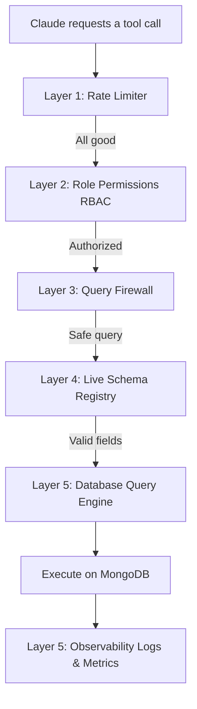

# Welcome to mongo-mcp-pro! 👋

Hey there! If you've ever wanted to give Claude (or another AI assistant) safe, observable access to your MongoDB databases without worrying about it running amok, you're in the right place. 

`mongo-mcp-pro` is a secure Model Context Protocol (MCP) server written in TypeScript. Think of it as a smart, secure translation gateway that lets an AI query your database while keeping your data safe behind several layers of security checks.

---

## 🌟 What is MCP, anyway?

If you are new to this ecosystem, **Model Context Protocol (MCP)** is a standard protocol (created by Anthropic) that acts like a **USB port for AI**. 

Instead of writing a custom integration every time you want an AI to read or write data, MCP defines a standard way for Claude to ask: *"Hey, can you run this tool for me?"* 
Our server receives these requests over standard input/output (stdin/stdout), runs the database operations safely, and passes the results back to Claude.

---

## 🛡️ The 5-Layer Security Shield

We don't just let the AI write raw database queries and run them. That would be a recipe for disaster (imagine Claude accidentally running an empty update query and modifying every user record!). 

Instead, every single query goes through our **5-Layer Pipeline** before it's allowed near your database:



### 1. The Rate Limiter (`src/security/rateLimit.ts`)
* **Why it's here:** To prevent Claude from getting stuck in an infinite query loop and spamming your database.
* **How it works:** It tracks calls per minute based on the assigned role: `reader` (300/min), `writer` (100/min), and `admin` (50/min).

### 2. Role-Based Access Control / RBAC (`src/security/rbac.ts`)
* **Why it's here:** Because a reader shouldn't be allowed to delete data.
* **How it works:** It maps operations to three distinct roles:
  * **Reader:** Can only search, aggregate, and count data.
  * **Writer:** Can also insert, update, and delete single documents.
  * **Admin:** Can do everything, including creating/dropping collections and bulk deleting.

### 3. The Query Firewall (`src/security/firewall.ts`)
* **Why it's here:** To stop destructive or malicious requests.
* **How it works:** It enforces four strict rules:
  1. **No System Collections:** No touching internal databases (like collections starting with `system.`).
  2. **No Empty Bulk Operations:** You cannot run `delete_many` or `update_many` without a filter. (No accidental database wipes!)
  3. **No `$where` JavaScript Injection:** The `$where` operator lets users run arbitrary JS code inside MongoDB. We block it entirely.
  4. **Max Nesting Depth of 5:** Stops overly complex, resource-heavy nested queries.

### 4. The Live Schema Registry (`src/schema/`)
* **Why it's here:** To make sure Claude is querying fields that actually exist in your database.
* **How it works:** It samples up to 100 documents to build a map of your fields (even nested ones inside arrays or objects) and caches it for 5 minutes. If Claude tries to filter or search by a field that doesn't exist, we reject it early.

### 5. Observability (`src/observability/`)
* **Why it's here:** So you always have a record of what the AI did.
* **How it works:** It writes every transaction (successful, blocked, or failed) to `logs/audit.jsonl` in structured JSON lines and tracks latency performance metrics in memory.

---

## 📂 How the Project is Organized

```
src/
├── config/
│   ├── env.ts          - Bootstraps and validates your .env file using Zod.
│   ├── db.ts           - The connection manager (singleton) for MongoDB.
│   └── roles.ts        - Registry containing which tools each role is allowed to use.
├── security/
│   ├── rbac.ts         - Checks if the user's role has permission to run the tool.
│   ├── firewall.ts     - Validates query safety (blocks injection, bulk wipes, etc.).
│   └── rateLimit.ts    - Protects the database from runaway loops and rate limits users.
├── schema/
│   ├── inferrer.ts     - Samples collection documents to dynamically discover fields.
│   ├── registry.ts     - Caches the inferred schemas for 5 minutes.
│   └── validator.ts    - Compares Claude's queries against the schema cache.
├── tools/
│   ├── index.ts        - The main orchestrator that coordinates the 5 security layers.
│   ├── read/           - Read tools (find, find_one, aggregate, etc.).
│   ├── write/          - Write tools (insert, update, delete).
│   ├── schema/         - Database schema metadata tools.
│   └── admin/          - Indexing and collection management tools.
├── observability/
│   ├── logger.ts       - Standard JSON logger.
│   ├── audit.ts        - Logs transactions to logs/audit.jsonl.
│   └── metrics.ts      - Measures tool counts and latencies.
├── types/
│   └── index.ts        - Shared TypeScript types and interfaces.
└── server.ts           - Entry point that connects DB and registers all 19 tools.
```

---

## ⚙️ Getting Started

### 1. Prerequisites
- Make sure you have **Node.js** (v20 or higher) installed.
- You'll need a running **MongoDB** database (locally or hosted on MongoDB Atlas).

### 2. Configure Your Environment
Create a file named `.env` in the root of the project:

```env
MONGO_URI=mongodb://localhost:27017
DB_NAME=mcpdb
ROLE=admin
SESSION_ID=dev-session
LOG_LEVEL=info
AUDIT_LOG_PATH=logs/audit.jsonl
```

> [!IMPORTANT]
> Customize these parameters to match your database:
> - **`MONGO_URI`**: Put your actual connection string here. If you are using MongoDB Atlas, replace `mongodb://localhost:27017` with your Atlas connection string (e.g., `mongodb+srv://<username>:<password>@cluster.mongodb.net/`).
> - **`DB_NAME`**: Set this to the specific database you want Claude to access.
> - **`ROLE`**: Restricts what Claude can do. Set this to `reader` (view only), `writer` (read/write only), or `admin` (full permissions).

### 3. Install Dependencies
Open your terminal in the project folder and run:
```bash
npm install
```

---

## 🚀 Running the Server

Since this is a TypeScript project, we compile our code before running it:

### Development Mode (On-the-Fly Compilation)
If you are modifying code and want to test changes quickly:
```bash
npm run dev
```

### Production Build (Compile to JS)
To compile and start the server:
1. **Compile the files:**
   ```bash
   npm run build
   ```
   *This compiles everything inside `src/` to standard JavaScript inside `dist/`.*
2. **Start the server:**
   ```bash
   npm run start
   ```

---

## 🛠️ Registering with Claude Desktop

To make these 19 tools available inside your Claude Desktop client:

1. **Open the Claude configuration folder:**
   Press `Win + R`, paste `%APPDATA%\Claude`, and hit Enter. Open `claude_desktop_config.json` in a text editor.

2. **Add `mongo-mcp-pro` to the config file:**
   Point it to your Node installation and your compiled `server.js` file:

   ```json
   {
     "mcpServers": {
       "mongo-mcp-pro": {
         "command": "C:\\Program Files\\nodejs\\node.exe",
         "args": [
           "C:\\Users\\Dharhshini\\mongo-mcp-pro\\dist\\server.js"
         ]
       }
     }
   }
   ```
   
   > [!NOTE]
   > You **don't** need to copy your environment variables into this JSON file! Our server configuration dynamically finds and loads the `.env` file directly from your project directory.

3. **Restart Claude Desktop:**
   Fully close Claude Desktop (from the Windows system tray) and reopen it. You will see a hammer icon indicating the tools are loaded and ready to go!

---

## 🔒 Permissions Cheat Sheet

Here is a quick look at what each role is allowed to do:

| Operation | Tool Name | Allowed Roles | Requires Confirmation? |
|---|---|---|---|
| **Read** | `find`, `find_one`, `count`, `distinct`, `aggregate` | `reader`, `writer`, `admin` | No |
| **Schema** | `list_collections`, `infer_schema`, `collection_stats`, `list_indexes` | `reader`, `writer`, `admin` | No |
| **Write** | `insert_one`, `insert_many`, `update_one`, `update_many`, `delete_one` | `writer`, `admin` | No |
| **Destructive Write** | `delete_many` | `admin` | **Yes (`confirm: true`)** |
| **Admin Setup** | `create_index`, `create_collection` | `admin` | No |
| **Admin Tear down** | `drop_index`, `drop_collection` | `admin` | **Yes (`confirm: true`)** |

---

## 🛡️ Production Readiness Checklist (Gaps to Close)

Is this server ready for a massive, multi-tenant cloud production environment? 

**For a local developer environment, yes!** It is secure, fast, and stable. However, if you are planning to deploy this as a cloud API to serve hundreds of different users, here are the **production gaps** you should address next:

* **Redis for State Persistence:** Right now, rate limits, metrics, and schema caches are stored in-memory. Because Claude regularly restarts MCP processes, this data is wiped out frequently. In a cloud setup, this state should be moved to **Redis** so it persists across restarts.
* **Strict Query Timeouts:** If Claude writes an unindexed query targeting a collection with millions of documents, it could spike your database CPU to 100%. We should add a timeout (like `maxTimeMS(2000)`) on all cursors to auto-terminate queries that run too long.
* **Dynamic JWT Authentication:** Currently, the server role is hardcoded in the `.env` file at startup. A multi-user production environment should require Claude to pass a security token (like a JSON Web Token) with each request so the server can authenticate the user and resolve their role dynamically.
* **Cloud Secrets Management:** Database credentials should be moved out of `.env` files and loaded securely from a cloud vault (like AWS Secrets Manager or GCP Secret Manager).
